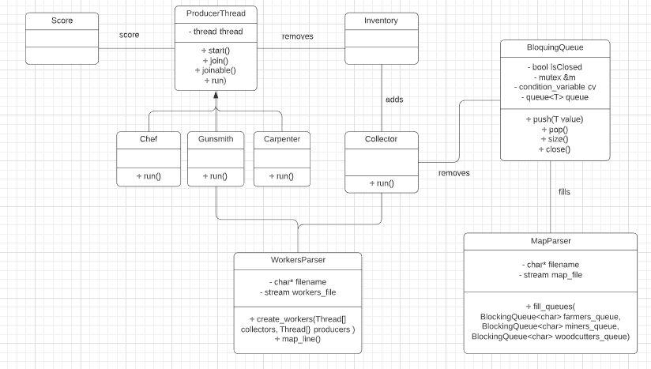
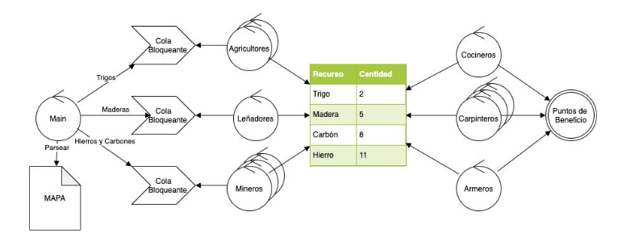

# TP2 - Recolectores y Productores - Taller de Programacion
Alumno: Tomas Szemzo - Padrón: 97771

Link al Repositorio: https://github.com/tszemzo/threads-tp2

## Resolución del Trabajo
 
 En primer lugar, voy a incluir un UML con el modelo utilizado para la solución parcial.
 
 UML:

Flujo del trabajo práctico:

